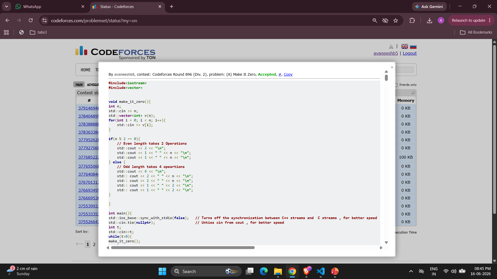
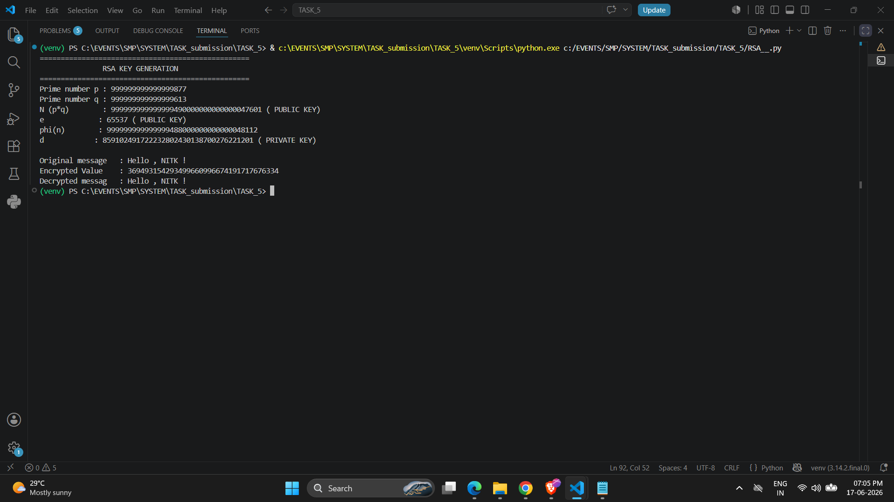

# TASK 5 : RSA Cryptography

An end-to-end cryptographic analysis progressing from exploiting fundamental RSA vulnerabilities to engineering a secure implementation from scratch.

---

## Task 1 : XOR (Codeforces 1869A)

## Algorithmic Logic

The problem allows picking any subarray `[l, r]` and replacing every element within that range with the Bitwise XOR sum of the entire subarray. 

The strategy relies on a core mathematical property of XOR: **Any number XORed with itself becomes zero (X XOR X = 0)** and **Any number XORed with 0 becomes the taken number itself (X XOR 0 = X)** 

### Case 1: Even Array Length (n is Even)

1. Operation 1: Apply the operation on the entire range `[1, n]`. Because the range has an even number of elements, the XOR sum of all elements is computed and assigned to every position. Now, the array consists of n identical numbers .
2. Operation 2: Apply the operation on the exact same range `[1, n]` again. Since `n` is even, we are XORing an even number of identical values together so the entire array drops to zero instantly in 2 operations.

### Case 2: Odd Array Length (n is Odd)

An odd-length range cannot be wiped directly because XORing an odd number of identical values leaves you with the original value. We must split the problem:
1. Operations 1 & 2: Apply the range `[2, n]`. This subarray has an **even** length ($n-1$). Running the operation twice over this range zeroes out everything from index `2` to `n`. The array now looks like: `[v[1], 0, 0, ..., 0]`.
2. Operations 3 & 4: Apply the range `[1, 2]`. This isolates the remaining non-zero element at index 1 alongside a single 0. Since a range of size 2 is an **even** length, executing the operation twice zeroes out the final remaining elements.
   The entire array drops to zero cleanly in **4 operations**.



---

## Task 2 : Even RSA Can Be Broken?

**Flag:**
```
picoCTF{tw0_1$_pr!m31c9046c4}
```

**Flaw / Logic:**
RSA's security depends on `n = p * q` being hard to factor, but here `n` is **even**, which immediately reveals that one of the prime factors must be `q = 2`. Once `q` is known, `p = n / 2` , `phi(n)` can be computed, and the private key `d` is fully recovered , breaking RSA entirely.

---

## Task 3 : RSA Implementation from Scratch
### 1. Custom Private Key Generation

* I implemented the **Extended Euclidean Algorithm** (`gcd_extended`) recursively from scratch to calculate Bezout coefficients. 
* I used this custom algorithm to mathematically derive the private decryption exponent `d` by finding the modular multiplicative inverse of the public exponent `e` modulo `phi(N)`.

### 2. Whole-String Byte Serialization
* Instead of looping through characters one by one , I structured the script to encrypt the entire string as a single block.
* I encoded the text into raw UTF-8 bytes and consolidated the entire byte array into a single massive Base-256 integer using Big-Endian serialization before running it through the modular exponentiation formula.

---

##  Verification Output



---

## Task 4 (Optional) : Modular Arithmetic Decoding

**Challenge:** Given 23 numbers, decode them using the following steps:

1. Take each number `mod 41`
2. Find the modular inverse of the result (mod 41)
3. Map to the character set: `1-26 --> A–Z`, `27-36 --> 0-9`, `37 --> _`

**Flag**
```
picoCTF{1nv3r53ly_h4rd_dadaacaa}
```

**Logic:**
Each number encodes a character through modular arithmetic. Taking `mod 41` reduces it to a residue, and finding the modular inverse (i.e., the value `x` such that `result * x ≡ 1 mod 41`) maps it back to an index in the character set. This is essentially a substitution cipher built on modular inverse operations.

---

## Task 5 (Optional) : Mini RSA : Small Exponent Attack

**Given:**
- `e = 3`
- `N` is a large modulus
- `c` is the ciphertext

**Flag**
```
picoCTF{e_sh0u1d_b3_lArg3r_92f4d5a5}
```
**Flaw / Logic:**
When the public exponent `e` is very small (here `e = 3`) and the plaintext `m` is short enough that `m³ < N`, the modular reduction in RSA (`c = m^e mod N`) never actually wraps around , meaning `c = m³` exactly as a plain integer. To decrypt, you simply compute the **real integer cube root** of `c` (no modular inverse needed, no private key required), which directly gives back `m`.


> RSA with a small `e` and short message is vulnerable because the math never enters modular space , the cube root is just a cube root.

