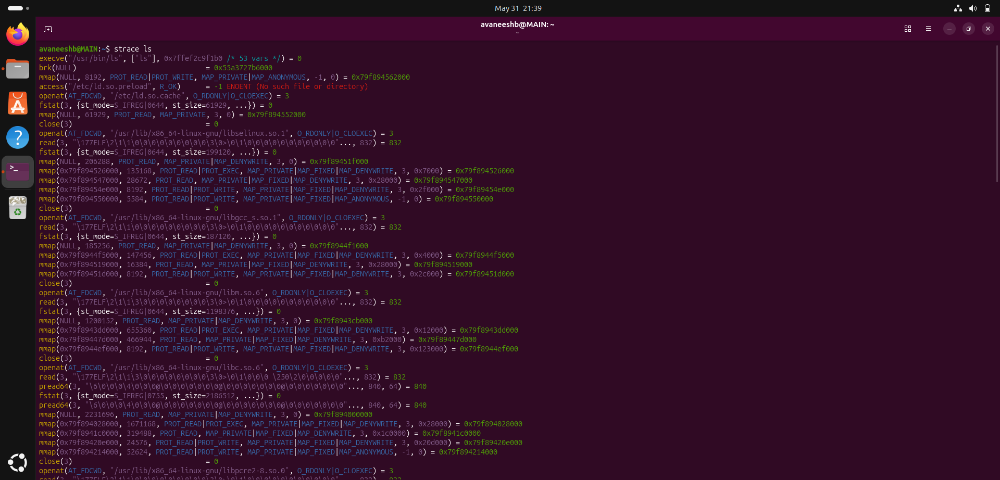
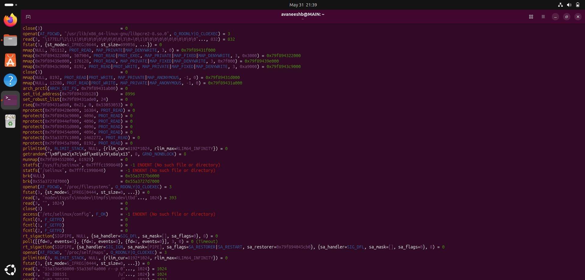
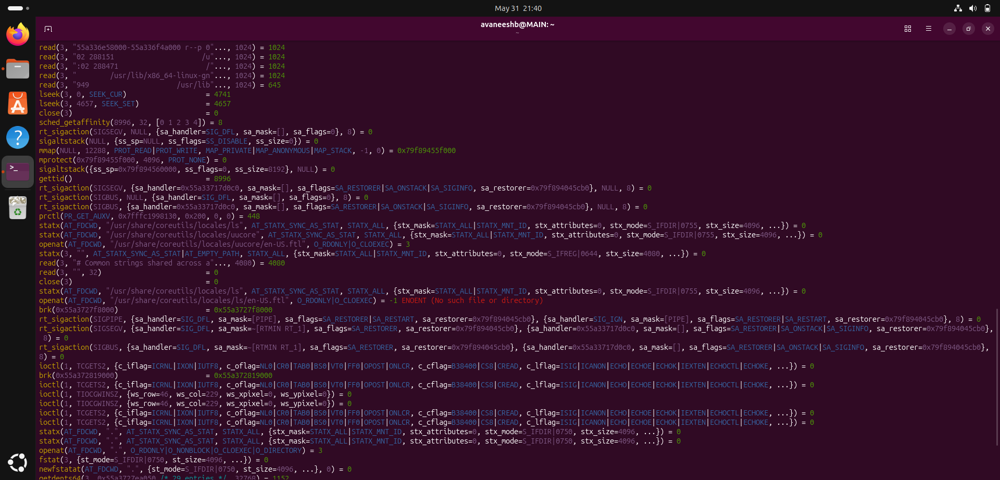
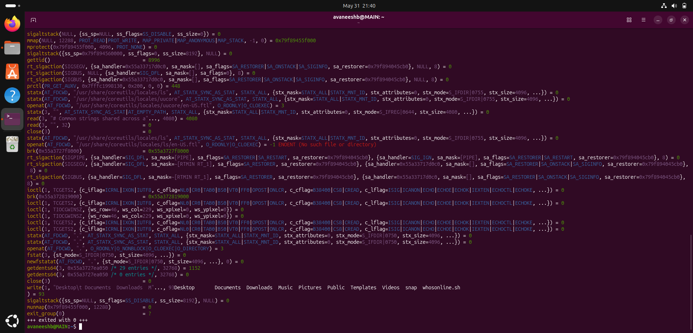
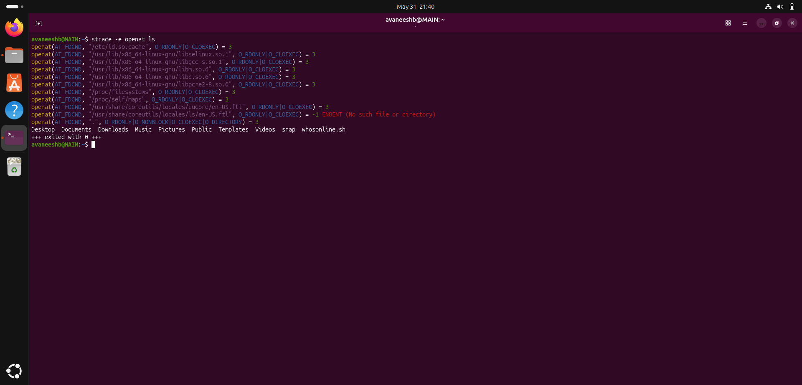

# Linux Syscalls and strace Assignment

## Overview

This task explores Linux system calls (syscalls) using the `strace` tool to observe how programs interact with the operating system kernel at runtime.

---

## Prerequisites

Before running the commands, make sure the following are available on your system.

### strace

`strace` is a diagnostic tool that intercepts and logs syscalls made by a running process. It may not be installed by default, check first and install if missing.

**Check if strace is installed:**

```bash
strace --version
```

If the command is not found, install it using your distro's package manager:

**Ubuntu / Debian:**
```bash
sudo apt update
sudo apt install strace
```

**Fedora / RHEL / CentOS:**
```bash
sudo dnf install strace
```

**Arch Linux:**
```bash
sudo pacman -S strace
```

Once installed, verify it works:

```bash
strace --version
```

---

## Commands Executed

### 1. Trace all syscalls made by `ls`

```bash
strace ls
```

Runs the `ls` command and prints every syscall it makes including `openat`, `read`, `mmap`, `close`, and many others.

### 2. Filter output to show only `openat` calls

```bash
strace -e openat ls
```

The `-e` flag filters the trace to only show syscalls matching the given expression. Here it shows only file-open related calls made by `ls`.

---

## Screenshots

> Screenshots of the terminal output are included below.

### `strace ls` output








 **Note:** The `read` syscall appeared **14 times** in this run. This number may vary depending on your system, Linux version, and the files present in the directory , it is not a fixed value.

### `strace -e openat ls` output


---

## Answers

### (a) What is a syscall?

A system call (syscall) is the programmatic interface that allows a user-space application to safely request privileged operations, such as hardware or file access, from the operating system kernel.

---

### (b) Syscalls and what they do

| Syscall | Description |
|---|---|
| `openat` | Opens a file or directory relative to a directory file descriptor, returning a handle used for reading or writing. |
| `read` | Reads a specified number of bytes from an open file descriptor into a memory buffer. |
| `write` | Writes data from a memory buffer out to an open file descriptor (file, socket, or terminal). |
| `close` | Closes an active file descriptor so it no longer refers to any file and can be reused. |
| `mmap` | Maps files or devices into the process's virtual memory space, enabling memory-mapped I/O or raw memory allocation. |
| `fork` | Creates a new child process by duplicating the calling parent process. |
| `execve` | Executes a new program by replacing the current process image with a new binary. |
| `getpid/getppid` | Returns the process ID of the calling process / parent process . |
| `mkdir` | Creates a new directory. |
| `kill` | Sends a signal (e.g. `SIGKILL`) to a process or process group. |
| `socket` | Creates a communication endpoint (TCP, UDP, Unix domain) and returns a file descriptor. |
| `getcwd` | Returns the absolute pathname of the process's current working directory as a string. |
---


