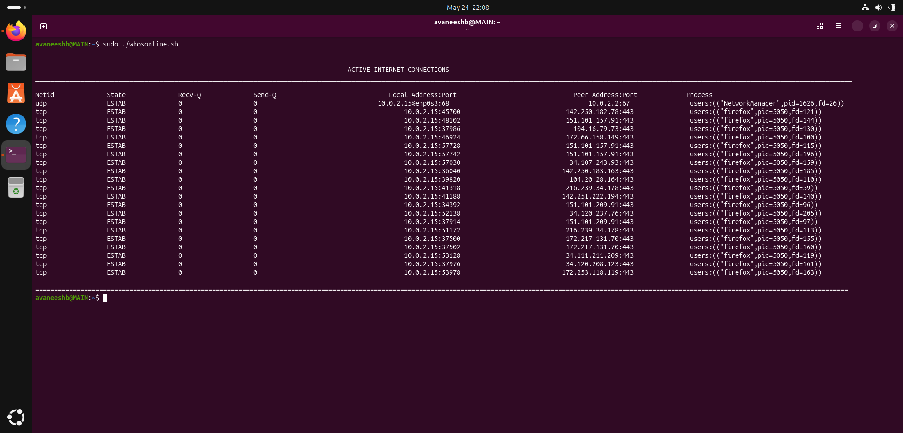
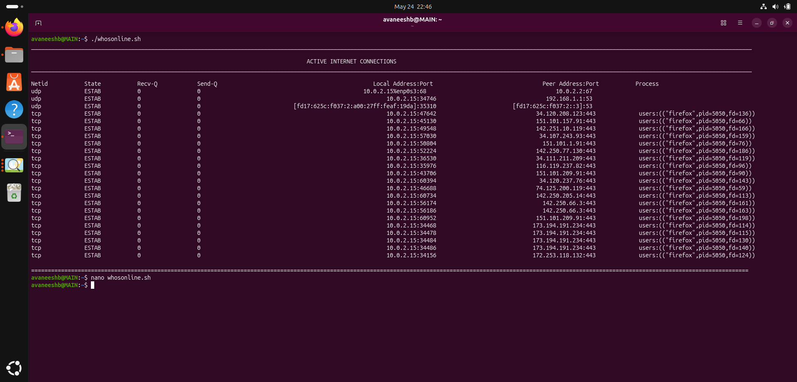

#  whosonline.sh : Monitor Active Internet Connections

A Bash script that displays all active TCP/UDP network connections on your Linux machine along with the processes using them.

---

##  Table of Contents

- [Overview](#overview)
- [Requirements](#requirements)
- [Installation](#installation)
- [Usage](#usage)
- [Output Explained](#output-explained)
- [Column Reference](#column-reference)
- [Root Privileges & Process Visibility](#root-privileges--process-visibility)
- [Recv-Q and Send-Q](#recv-q-and-send-q)
- [Example Output](#example-output)
- [Script Contents](#script-contents)

---

## Overview

`whosonline.sh` uses the `ss` (Socket Statistics) command to show:

- Which **IP addresses and ports** your machine is connected to
- The **status** of each connection
- The **process/program** responsible for each connection

---

## Requirements

- Linux operating system
- Bash shell
- `ss` command 
- `sudo` / root privileges 

---

## Installation

```bash
# Clone the repository
git clone https://github.com/Avaneeshb55/SYSTEMS_SMP.git

# Navigate into TASK_1 folder
cd SYSTEMS_SMP/TASK_1

# Make the script executable
chmod +x whosonline.sh
```

---

## Usage

### Run with sudo 

```bash
sudo ./whosonline.sh
```

### Run without sudo

```bash
./whosonline.sh
```

Will show an error along with the necessary steps to be done to run the script file

---

## Output Explained

When the script runs with root privileges, it produces a table like this:



---

## Column Reference

| Column | Description | Example |
|--------|-------------|---------|
| `Netid` | Network protocol | `tcp`, `udp` |
| `State` | Current connection status | `ESTAB`, `LISTEN`, `TIME-WAIT` |
| `Recv-Q` | Bytes received but not yet read by the app | `0` |
| `Send-Q` | Bytes sent but not yet confirmed by other side | `0` |
| `Local Address:Port` | Your machine's IP and port | `10.0.2.15:57030` |
| `Peer Address:Port` | Remote destination IP and port | `34.107.243.93:443` |
| `Process` | Program name, PID, and file descriptor | `users:(("firefox",pid=5050,fd=159))` |

### Connection States

| State | Meaning |
|-------|---------|
| `ESTAB` | Active two-way connection in progress |
| `LISTEN` | Waiting for incoming connections (server side) |
| `TIME-WAIT` | Connection closing : waiting to ensure all packets arrived |
| `CLOSE-WAIT` | Remote side closed, local side is finishing up |
| `SYN-SENT` | Connection request sent, waiting for a response |

### Common Ports

| Port | Protocol |
|------|----------|
| `22` | SSH |
| `80` | HTTP |
| `443` | HTTPS |
| `67/68` | DHCP |
| `53` | DNS |

---

## Root Privileges & Process Visibility

Linux controls which process information is visible based on **who owns the process**

| Process Owner | Visible Without `sudo`? |
|---------------|--------------------------|
| You (current user) |  Yes , fully visible |
| Root / System |  No , blank in Process column |
| Another user |  No, blank in Process column |

So the processes initiated by the user is visible , while the processes initiated by the root is not visible.In the output screenshot , the processes associated with firefox browser were initiated by the user so its visible, while the processes initited by the root is not visible. 

## Example Output

### Screenshot — Without Root Privileges



The screenshot above shows the `ss -tunp` output when running **without sudo**. Notice:
- The **Process column is blank** for system-owned connections 
- **User-owned processes** like Firefox remain visible

**NOTE : In the given script file if the user runs the script file then an error message will be shown , the above screenshot was obtained by removing the 'if' condition block** 

---

## Recv-Q and Send-Q

These are **queue counters** showing how many bytes are stuck waiting in the network buffer.

| Queue | What it tracks | Non-zero means... |
|-------|---------------|-------------------|
| `Recv-Q` | Data arrived at your machine but app hasn't read it yet | App is too slow to process incoming data |
| `Send-Q` | Data your app sent but not yet confirmed by receiver side | Network is slow or remote is unresponsive |

 **In a healthy system, both values should almost always be `0`.** Consistently non-zero values indicate a network problem or overloaded application.

---


## Script Contents

[SCRIPT](Screenshots/Script.png)

---

## How the Root Check Works

```bash
if [ "$EUID" -ne 0 ]; then
```

| Part | Meaning |
|------|---------|
| `$EUID` | Effective User ID : Root is always `0` |
| `-ne 0` | "Not equal to 0" : i.e., not root |
| `exit 1` | Stop the script with error code `1`(non-zero number) |
| `fi` | End of the `if` block('if' spelled backwards) |

Therefore if the user runs the script file without sudo then an error will be displayed along with the necessary steps to be done to run the script file

### A screenshot showing the execution of the script file without root privileges :

[ERROR](Screenshots/Error.png)

---

## ss Command Flags

```bash
ss -tunp
```

| Flag | Meaning |
|------|---------|
| `-t` | Show TCP connections |
| `-u` | Show UDP connections |
| `-n` | Show numeric IPs and ports (no DNS resolution) |
| `-p` | Show process/program using the connection |

---


