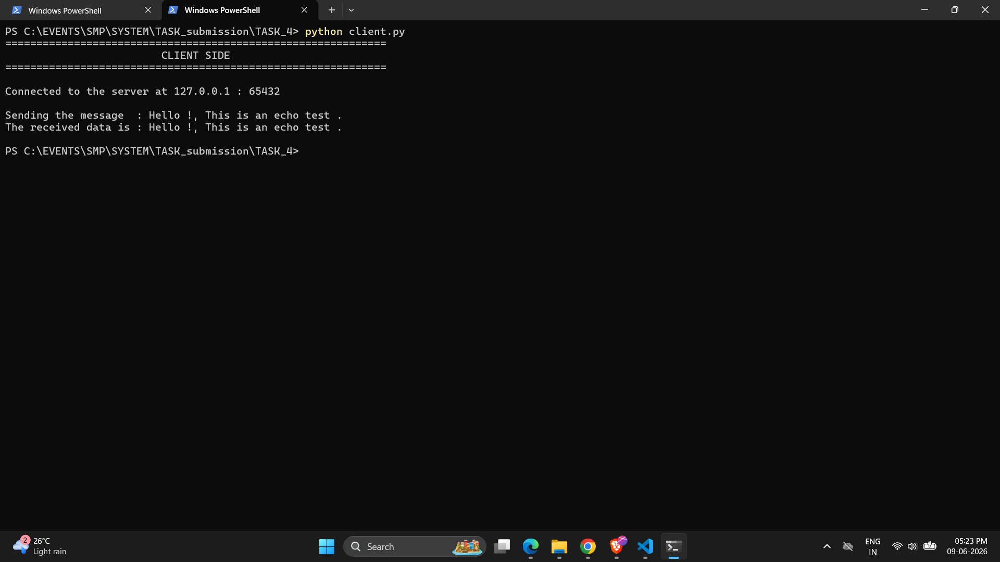
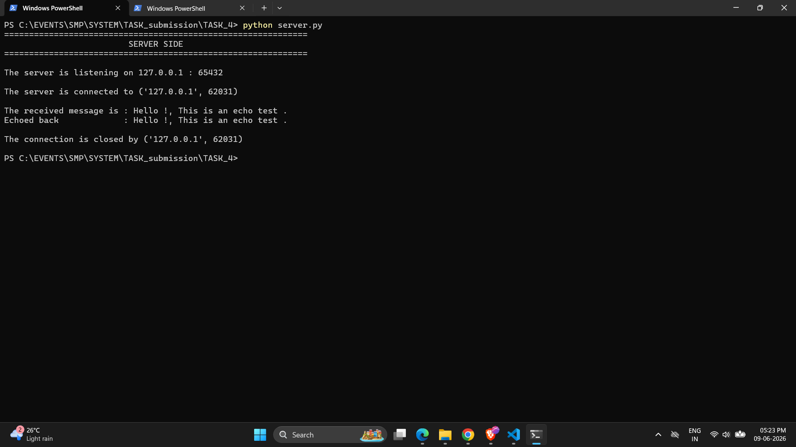

# TCP Echo Server & Client

A simple TCP echo server and client implemented in Python using the `socket` module. The server listens for incoming connections, receives data, and echoes it back to the client.

---

##  Requirements

- Python 3.x 

---

## How to Run

Since the server and client are separate processes, you need **two terminal windows**.

### Step 1 : Start the Server

```bash
python server.py
```

Expected output:
```
=============================================================
                        SERVER SIDE
=============================================================

The server is listening on 127.0.0.1 : 65432
```

### Step 2 : Start the Client (in a new terminal)

```bash
python client.py
```

Expected output:



Back in the **server terminal**, you should see:



---

## How It Works

### Server (`server.py`)

| Step | Description |
|------|-------------|
| Create socket | Creates a TCP socket using `AF_INET` (IPv4) and `SOCK_STREAM` (TCP) |
| `SO_REUSEADDR` | Allows the port to be reused immediately after the server stops |
| `bind()` | Binds the socket to `127.0.0.1:65432` |
| `listen()` | Puts the server in listening mode for incoming connections |
| `accept()` | Blocks and waits for a client to connect |
| `recv(1024)` | Receives up to 1024 bytes of data from the client |
| `sendall()` | Echoes the exact same data back to the client |

### Client (`client.py`)

| Step | Description |
|------|-------------|
| Create socket | Creates a TCP socket using `AF_INET` and `SOCK_STREAM` |
| `connect()` | Connects to the server at `127.0.0.1:65432` |
| `sendall()` | Sends the message encoded as UTF-8 bytes |
| `recv(1024)` | Receives the echoed response from the server |

---

## Configuration

Both the host and port can be changed via the function parameters:


| Parameter | Default     | Description              |
|-----------|-------------|--------------------------|
| `host`    | `127.0.0.1` | Localhost (loopback)     |
| `port`    | `65432`     | Port number (1024–65535) |

---

## NOTE :

>This project uses `127.0.0.1` as the host, which is known as the **loopback address** (or `localhost`).

It is a special reserved IP address that makes your computer communicate with itself. When the client sends data to `127.0.0.1`, the operating system intercepts it internally and routes it back to the server running on the same machine ,no network is involved at any point.This ensures that the data never leaves your machine and it is completely isolated from the outside world .

---

## References

- [Python Socket HOWTO](https://docs.python.org/3/howto/sockets.html)
- [Python `socket` Module Docs](https://docs.python.org/3/library/socket.html)
