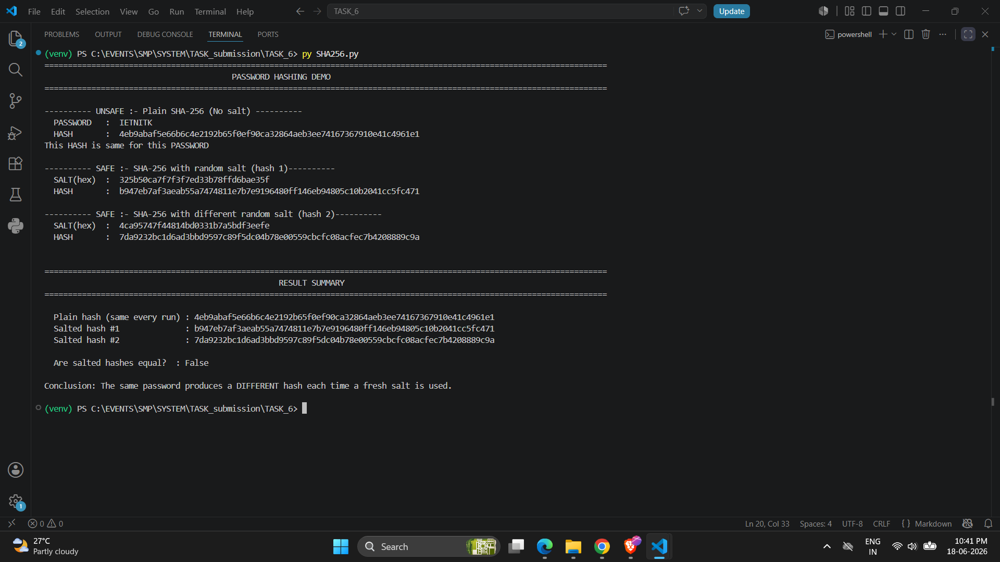

# Task-6 : Password Hashing: Safe vs Unsafe

## Overview

This program demonstrates three ways to hash the password `"IETNITK"` using Python's built-in `hashlib` library, and explains why only the salted approaches are secure.

---

## How to Run

```bash
python SHA256.py
```

No external dependencies are needed only the Python standard library.

---
## Output

Here is the screenshot of the program output which displays the `PASSWORD`, `HASH` values of plain and salted SHA-256.



---
## What the Program Does

| Step | Method | Safe? |
|------|--------|-------|
| 1 | Plain SHA-256 (no salt) |  No |
| 2 | SHA-256 with random salt 1 prepended |  Yes |
| 3 | SHA-256 with random salt 2 prepended |  Yes |

### Step 1 : Plain SHA-256
```
hash = SHA256("IETNITK")
```
The same password always produces the exact same hash every single run.

### Step 2 : SHA-256 with Salt #1
```
salt1=os.urandom(16)                         # 16 cryptographically random bytes
salted_input1= salt1 + PASSWORD.encode()
salted_hash1 = hashlib.sha256(salted_input1).hexdigest()
```
A fresh random salt is generated and prepended before hashing.

### Step 3 : SHA-256 with Salt #2
```
salt2=os.urandom(16)                         # 16 cryptographically random bytes
salted_input2= salt2 + PASSWORD.encode()
salted_hash2 = hashlib.sha256(salted_input2).hexdigest()
```
A second independent salt produces a completely different hash for the **identical** password, proving that salting defeats pre-computed attacks.

---

## Why Option 1 (Plain SHA-256) Is Dangerous

### 1. Deterministic Output : Rainbow Table Attacks

SHA-256 is a deterministic function: the same input always yields the same output. Attackers maintain **rainbow tables** , giant pre-computed databases that map millions of common password hashes back to their plain-text values.The unsalted hash of `"IETNITK"` will be the same on every machine on the planet, so a single lookup in such a table can instantly reveal the password.

### 2. Dictionary & Brute-Force Attacks Are Cheap

Because hashing is fast, an attacker who obtains an unsalted hash can systematically try every word in a dictionary or every short string until a match is found.There is no per-attempt cost that slows them down.

### 3. Identical Passwords Share Identical Hashes
If two users choose the same password, their stored hashes will be identical.Cracking one immediately reveals the other and tells the attacker which accounts share credentials.

---

## Why Salting (Options 2 & 3) Solves These Problems

| Problem | How Salt Fixes It |
|---------|-------------------|
| Rainbow tables | The salt is unique per user; pre-computed tables don't include salted variants |
| Shared hashes | Two users with the same password get different salts , different hashes |
| Brute-force speed | Each guess must be rehashed with the correct salt; no reuse across accounts |

A salt does **not** need to be secret , it is stored alongside the hash.
Its purpose is uniqueness, not secrecy.

---
