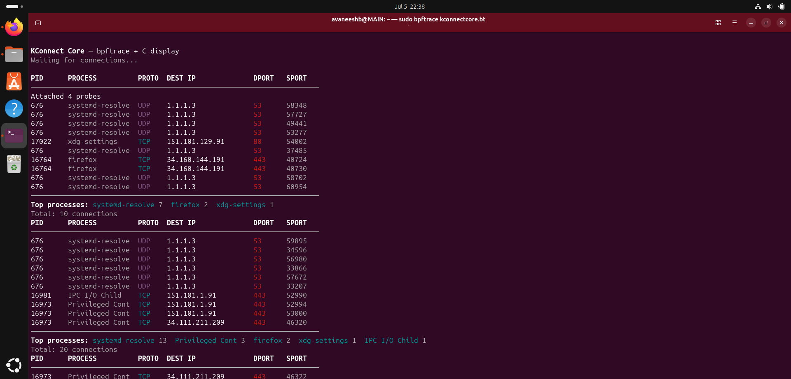
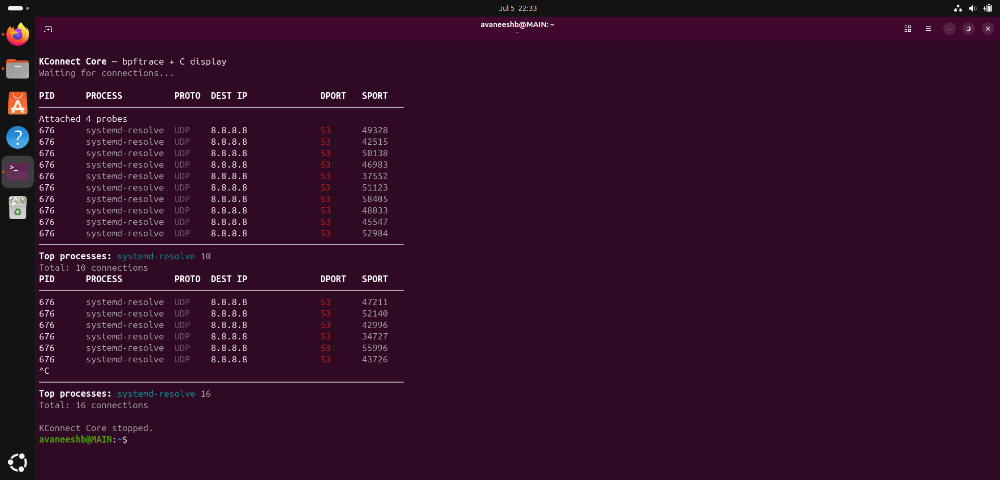

# KConnect Core

A live network-connection monitor built with **bpftrace** (kernel-side tracing) and a **C display program** (userspace rendering). `kconnectcore.bt` traces TCP and UDP socket activity in the kernel and streams it to `kconnectcore.c`, which renders a live terminal dashboard.

## Files

| File | Role |
|---|---|
| `kconnectcore.c` | Reads pipe-delimited connection events from stdin and displays them in a formatted, color-coded live table . |
| `kconnectcore.bt` | bpftrace script attaches to kernel probes, extracts connection details, and prints them in the format `kconnectcore.c` expects |

## Pipe Format

```
pid|comm|proto|daddr|dport|sport
```

Six fields, pipe-delimited, one connection event per line. This format is fixed by `kconnectcore.c`'s parser (`strtok` on `|`, 6 tokens).

## Setup

```bash
# bpftrace (Ubuntu/Debian)
sudo apt update && sudo apt install -y bpftrace gcc build-essential

# confirm BTF support 
ls /sys/kernel/btf/vmlinux
```

## Execution

Compile the display program:
```bash
gcc -o kconnectcore kconnectcore.c
```

Run the pipeline:
```bash
sudo bpftrace kconnectcore.bt | ./kconnectcore
```

**All processes:**



### Optional: PID targeting

Pass a PID as the first argument to trace only that process instead of the whole system:

```bash
sudo bpftrace kconnectcore.bt 676 | ./kconnectcore
```

**Filtered to PID 676:**



---
## Kernel Probes Used

| Probe | Type | Purpose |
|---|---|---|
| `tcp_set_state` | `kprobe` | Fires on every TCP state transition; filtered to `state == 1` (`TCP_ESTABLISHED`) to emit only connections that actually succeeded. Handles both IPv4 and IPv6 in one probe by branching on `skc_family`. |
| `udp_sendmsg` | `kprobe` | Fires on every IPv4 UDP send. Used as the closest analogue to "a UDP connection happened," since UDP has no handshake. |
| `udpv6_sendmsg` | `kprobe` | Same as above, for IPv6 UDP sends. |

All three read connection details (destination address, destination port, source port) directly from `struct sock` via `__sk_common`, using BTF - no kernel headers are included, since a BTF-enabled kernel already provides the struct layout, and including real kernel headers breaks standalone compilation.

## Design Notes

### TCP: established-only, and its trade-off

TCP events are emitted only once `tcp_set_state` confirms a socket reached `TCP_ESTABLISHED` (state `1`), not at the moment `connect()` is called. This means:

- **Benefit:** failed, refused, or still-pending connection attempts never appear - every TCP line shown is a connection that genuinely succeeded, which keeps the display meaningful rather than noisy.
- **Trade-off:** this is also a blind spot for anything defined by connections that never complete. A SYN flood / DDoS pattern is characterized by huge numbers of connection attempts that deliberately never reach `ESTABLISHED` (half-open connections, no final ACK), this script, by design, would show nothing unusual during such an attack, since it only reports success.

### Byte order handling

`skc_dport` is stored in network byte order (big-endian). `bswap()` converts it to host byte order before printing. `skc_num` (source/local port) is already stored in host byte order and needs no conversion. Destination IP addresses are converted with `ntop()`, which expects the raw network-byte-order value directly (no `bswap()` needed for addresses).

### Loopback filtering

`127.0.0.0/8` traffic is filtered on the IPv4 side by byte-swapping the destination address and checking its top byte. IPv6 loopback (`::1`) is not filtered; comparing the raw 16-byte kernel field against `pton("::1")` throws a `string[16]` vs `uint8[16]` type mismatch on this bpftrace version, and IPv6 loopback traffic is rare enough in practice that this was left unfiltered .

### PID targeting

PID targeting lets the script narrow its focus to a single process instead of showing every connection on the machine, which is useful when you already suspect a specific process and want to isolate just its traffic. This works via bpftrace's positional argument ($1), checked in a predicate ($1 == 0 || pid == $1) on every probe, so unwanted events are dropped in-kernel before they ever reach userspace rather than being filtered afterward. If no PID is supplied, $1 defaults to 0, and since PID 0 is the kernel idle task and never a real connecting process, the script correctly interprets this as "no filter" and shows connections from all processes on the system. Passing an actual PID (e.g. 676) restricts the output to only that process's connections. This makes the same script usable both as a system-wide monitor and a focused, single-process trace, depending on whether an argument is given.

---
## Known Limitations

- **TCP vs UDP only.** No ICMP, no raw sockets, no other transport protocols, the script only hooks TCP and UDP kernel functions, so nothing else is ever traced or forwarded.
- **No application-layer visibility.** The kernel functions hooked here only see IP/port/PID, there's no way to distinguish HTTP from HTTPS, or DNS from DNS-over-HTTPS, since DoH is just DNS queries wrapped in an ordinary TLS connection to port 443. That distinction would require TLS SNI inspection or deep packet inspection.
- **No parent-process visibility in this pipeline.** Showing which process spawned a connecting process would require a 7th field in the pipe format, which means modifying `kconnectcore.c`'s struct and parser which I have avoided.
- **Inbound connection attribution can be imprecise.** For server-side (accepted) connections, the `pid`/`comm` observed at the `ESTABLISHED` transition can sometimes reflect a kernel worker context rather than the actual application, since accept-side state transitions don't always happen inside the application's own process context.
